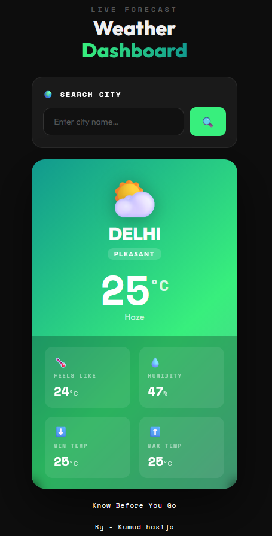
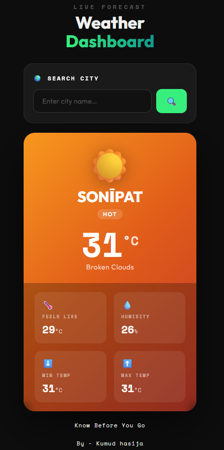

# 🌤️ Weather App - React

> **Know Before You Go** — A clean, real-time weather dashboard built with React and Vite.

[](https://weather-application-kumud-project.vercel.app/)
[](https://reactjs.org/)
[](https://vitejs.dev/)

---


   

---

## 📖 About

Weather App is a responsive, real-time weather dashboard built as a React learning project. It lets you search any city in the world and instantly see the current temperature, humidity, feels-like temperature, and min/max range - all presented in a clean dark-themed UI.

The project was built to practice React fundamentals including component architecture, state management with `useState`, async API calls with `fetch`, conditional rendering, and CSS animations - all wired together.

---

## 📸 Preview

The UI dynamically changes its theme, icon, and color palette based on weather conditions:

| Condition | Theme | Icon |
|-----------|-------|------|
| Humidity > 80% | 🔵 Deep Blue | 🌧️ Rainy |
| Temp > 30°C | 🔴 Warm Orange | ☀️ Hot |
| Temp 15–30°C | 🟢 Teal Green | ⛅ Pleasant |
| Temp < 15°C | 🌑 Dark Navy | ❄️ Cold |

---

## ✨ Features

-  **Live city search** — instant weather lookup via OpenWeatherMap API
-  **Dynamic theming** — card gradient, icon, and badge adapt to current conditions
-  **Detailed stats** — temperature, feels like, min/max, and humidity
-  **Smooth animations** — floating icon and card entrance animation on every search
-  **Error handling** — clear feedback for invalid city names
-  **Responsive design** — works on mobile and desktop

---

## 🛠️ Tech Stack

| Technology | Purpose |
|------------|---------|
| [React 18](https://reactjs.org/) | UI framework |
| [Vite](https://vitejs.dev/) | Build tool & dev server |
| [OpenWeatherMap API](https://openweathermap.org/api) | Weather data |

---

## 📁 Project Structure

```
src/
├── App.jsx             # Root component
├── App.css             # App shell & header styles
├── WeatherApp.jsx      # Main state management
├── Search.jsx          # Search input & API call
├── Search.css          # Search card styles
├── Info.jsx            # Weather display card + dynamic theming
├── Info.css            # Weather card styles & animations
├── index.css           # Global body styles & font import
└── main.jsx            # React entry point
```

---

## 🚀 Getting Started

### Prerequisites

- Node.js `v18+`
- npm 

### Installation

1. **Clone the repository**

   ```bash
   git clone https://github.com/Kumud-hasija/Weather-App-using-react.git
   cd Weather-App-using-react
   ```

2. **Install dependencies**

   ```bash
   npm install
   ```

3. **Set up your API key**

   Open `src/Search.jsx` and replace the `API_KEY` value with your own key from [OpenWeatherMap](https://openweathermap.org/api):

   ```js
   const API_KEY = "your_api_key_here";
   ```

4. **Start the development server**

   ```bash
   npm run dev
   ```

5. Open [http://localhost:5173](http://localhost:5173) in your browser.

---


## 👤 Author

**Kumud Hasija**

- GitHub: [@Kumud-hasija](https://github.com/Kumud-hasija)

